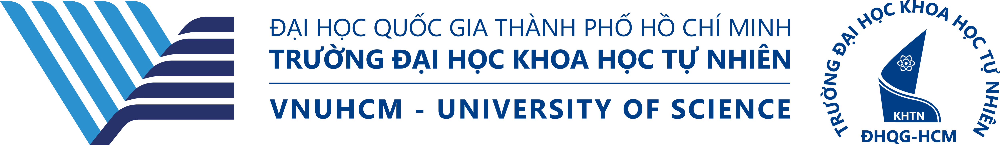

# 
Fundamentals of Programming
 

## 📌 Basic Information
### 🏫 School Information
University of Sciences, Vietnam National University Ho Chi Minh City is a center for undergraduate and graduate education, providing human resources and a team of highly qualified experts in the fields of basic sciences, interdisciplinary sciences, and cutting-edge science and technology. These professionals possess creative abilities and can work in competitive international environments. The university conducts cutting-edge scientific research to create high-quality products that meet the country's increasingly high demands for science and technology development and economic and social development, in line with global development trends.

Source: [Vietnam National University, Ho Chi Minh City - University of Science](https://tuyensinh.hcmus.edu.vn/). Translated with DeepL.com (free version)

### 🖥️ Repository Information
This repository contains the exercises for the **Fundamentals of Programming** course at **VNU-HCMUS**. This is the only programming subject in the first-year, first-semester curriculum.  
**Programming Language**: C++  
**IDE**: Microsoft Visual Studio 2026  
**Author**: [Võ Thiện Trí Nhân](https://github.com/MikenVo)  
**Date**: 26-01-2025 -> NOW
#### ⌛ Topics
1. ~~Programming Overview~~
2. ~~Basic Concepts in Programming~~
3. ~~Flow of Control~~
4. ~~Functions~~
5. ~~Arrays~~
6. ~~String~~
7. ~~Structures~~
8. ~~Files~~
9. ~~Pointers~~
10. ~~Advanced Pointers~~
11. ~~Binary File~~
12. ~~Linked List~~
13. ~~Stack & Queue~~
## Contact
**Email**: [vttnhan2518@clc.fitus.edu.vn](vttnhan2518@clc.fitus.edu.vn)  
**GitHub**: [MikenVo](https://github.com/MikenVo)