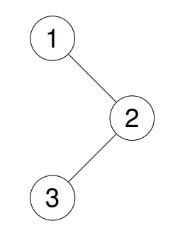
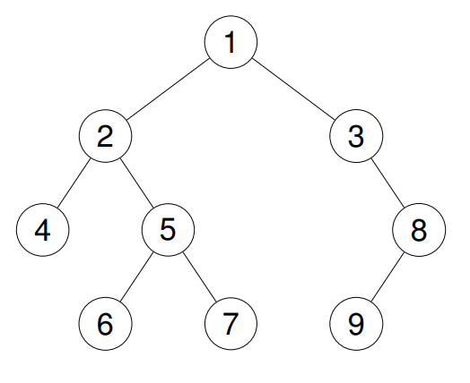

# <p align='center'> Binary Tree Preorder Traversal </p>
<p align='center'> Source: <a href='https://leetcode.com/problems/binary-tree-preorder-traversal/'>LeetCode - Binary Tree Preorder Traversal</a> </p>

Given the `root` of a binary tree, return the preorder traversal of its nodes' values.

### Example 1:
```
Input: root = [1,null,2,3]
Output: [1,2,3]
```


### Example 2:
```
Input: root = [1,2,3,4,5,null,8,null,null,null,6,7,9]
Output: [1,2,4,5,6,7,3,8,9]
```


### Example 3:
```
Input: root = []
Output: []
```

### Example 4:
```
Input: root = [1]
Output: [1]
```

### Constraints:
- The number of nodes in the tree is in the range `[0, 100]`.
- `-100 <= Node.val <= 100`